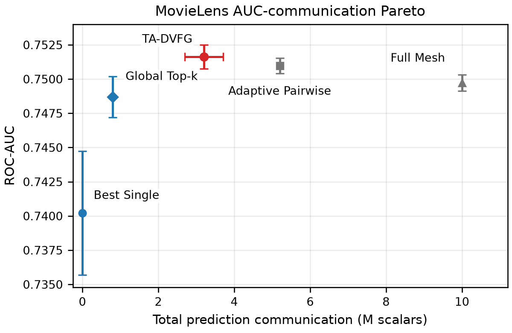
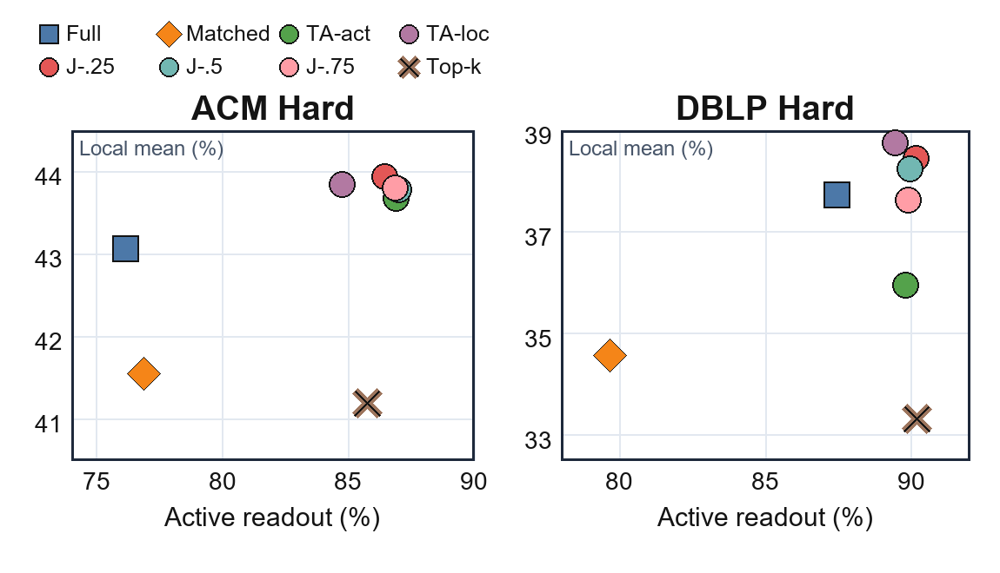

# TA-DVFG

TA-DVFG learns sparse prediction-space collaboration topologies for heterogeneous graph predictors without aligning hidden representations.



## Research Question

Can heterogeneous predictors over vertical graph views collaborate without aligning their internal representations?

## Method

TA-DVFG separates training from collaboration:

1. Each party independently trains a local graph-view predictor.
2. A validation-assisted selector learns a sparse prediction topology.
3. At inference time, parties exchange compatible class distributions over selected links and aggregate in prediction space.

Hidden representations remain local. Communication uses task-level prediction vectors rather than private hidden states or representation-alignment payloads.

## Main HGB Results

Global Top-k is a centralized participant-selection reference and solves a different deployment problem. TA-DVFG should be read primarily against the directly comparable peer-to-peer methods.

| Method                   |         ACM Main |         ACM Hard |        DBLP Main |        DBLP Hard |        IMDB Main |        IMDB Hard |
| ------------------------ | ---------------: | ---------------: | ---------------: | ---------------: | ---------------: | ---------------: |
| Global Top-k             |     89.82 ± 1.01 |     85.50 ± 2.78 |     91.43 ± 0.65 |     90.57 ± 1.04 |     39.27 ± 0.87 |     30.44 ± 0.92 |
| Full Mesh                |     85.96 ± 2.30 |     75.52 ± 5.04 |     90.86 ± 0.49 |     88.01 ± 1.45 |     28.49 ± 0.77 |     29.03 ± 1.33 |
| Adaptive Pairwise        |     86.56 ± 2.46 |     76.41 ± 4.57 |     90.96 ± 0.52 |     87.91 ± 1.34 |     28.71 ± 0.59 |     29.19 ± 1.30 |
| Adaptive Complementarity |     85.86 ± 1.77 |     76.74 ± 5.19 |     90.69 ± 0.53 |     87.32 ± 1.60 |     28.51 ± 0.89 |     28.87 ± 1.18 |
| **TA-DVFG**              | **89.52 ± 1.71** | **85.54 ± 2.91** | **91.50 ± 1.37** | **90.25 ± 1.14** | **38.65 ± 0.86** | **30.08 ± 0.97** |

TA-DVFG achieves the highest mean among directly comparable peer-to-peer methods across the six HGB settings while selecting only roughly 5-6 links out of 105 possible links.

## Joint Deployment Result

| Dataset   | Method                 |    Active |     Local | Links |
| --------- | ---------------------- | --------: | --------: | ----: |
| ACM Hard  | Full Mesh              |     76.14 |     43.07 |   105 |
| ACM Hard  | **TA-DVFG joint-0.25** | **86.43** | **43.94** | **5** |
| DBLP Hard | Full Mesh              |     87.44 |     37.73 |   105 |
| DBLP Hard | **TA-DVFG joint-0.25** | **90.15** | **38.45** | **6** |

In the reported strict label-location setting, the joint-0.25 configuration uses more than 94% less peer communication than Full Mesh.



## MovieLens Result

| Method            |    ROC-AUC | Total communication |
| ----------------- | ---------: | ------------------: |
| Best Single       |     0.7402 |                   0 |
| Global Top-k      |     0.7487 |               0.80M |
| Adaptive Pairwise |     0.7510 |               5.20M |
| Full Mesh         |     0.7497 |              10.00M |
| **TA-DVFG**       | **0.7516** |           **3.20M** |

TA-DVFG achieves the highest mean AUC in this comparison while transmitting 68% fewer scalars than Full Mesh. The AUC margin is small, so the result is best interpreted as an accuracy-communication trade-off rather than a large predictive improvement.

## Mechanism Evidence


Mechanism and deployment studies test whether the selected sparse topology reflects more than a dense communication budget. The reproducibility files map each table and figure to raw outputs, summaries, scripts, and validation commands.

## Reproduction

Install dependencies:

```bash
python -m venv .venv
python -m pip install -r requirements.txt
```

Lightweight validation:

```bash
python -m pytest tests/unit tests/smoke -q
python scripts/verify_reported_values.py
python scripts/verify_supplement_coverage.py
```

Full experiment instructions are separated into no-rerun, lightweight, and full-rerun levels in [REPRODUCE.md](REPRODUCE.md).

## Repository Structure

| Path | Contents |
|---|---|
| `core/`, `main experiment/` | Preserved HGB engine and core TA-DVFG implementation |
| `models/` | MovieLens party predictors |
| `experiments/` | HGB, MovieLens, scaling, sensitivity, alignment, and analysis runners |
| `analysis/` | Mechanism and provenance audit entry points |
| `configs/`, `metadata/` | Audited experiment manifests and paper values |
| `docs/` | Supplement map, code crosswalk, provenance, and package reports |
| `figures/` | Curated README figures copied from protected paper figure assets |
| `tests/`, `scripts/` | Verification, smoke tests, package checks, and regeneration utilities |

## Provenance

See [docs/RESULT_PROVENANCE.md](docs/RESULT_PROVENANCE.md), [docs/SUPPLEMENT_TO_CODE_MAP.md](docs/SUPPLEMENT_TO_CODE_MAP.md), and [docs/PAPER_CODE_CROSSWALK.md](docs/PAPER_CODE_CROSSWALK.md). Datasets, large caches, generated results, logs, and package archives are intentionally excluded from Git.

## Citation and License

Author-identifying citation metadata and publication-status wording are intentionally omitted while this artifact may be used in anonymous review. No repository license was present in the source history; treat the code as all-rights-reserved until an explicit license is added.
