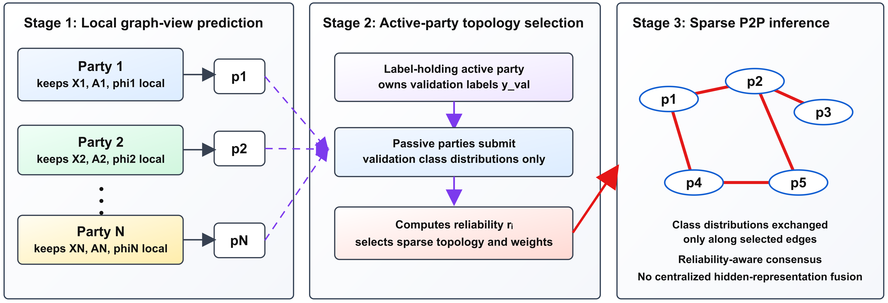
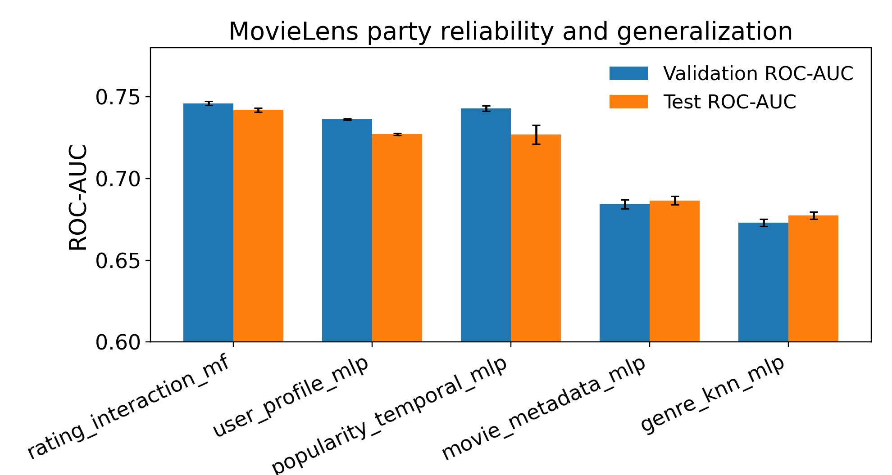

# TA-DVFG

TA-DVFG learns sparse prediction-space collaboration topologies for heterogeneous graph predictors without aligning hidden representations.

## Method Overview

Each party trains a local graph-view predictor, then a validation-assisted selector learns a sparse prediction topology. At inference time, selected peers exchange compatible class distributions and aggregate in prediction space, while hidden representations, graph views, adjacency matrices, features, and labels remain local to each party.



## Key Results

Across the six HGB settings reported in the manuscript, TA-DVFG has the highest mean among directly comparable peer-to-peer methods while selecting only roughly 5-6 links out of 105 possible links. On MovieLens, TA-DVFG reports the highest mean ROC-AUC in the comparison while transmitting 68% fewer scalars than Full Mesh; that result is best read as an accuracy-communication trade-off rather than a large predictive-margin claim.

The machine-readable tables are tracked under [results/tables/](results/tables/):

- [hgb_main_results.csv](results/tables/hgb_main_results.csv)
- [movielens_results.csv](results/tables/movielens_results.csv)
- [joint_deployment_results.csv](results/tables/joint_deployment_results.csv)
- [k_sensitivity_summary.csv](results/tables/k_sensitivity_summary.csv)

## Main Result Table

| Method                   |         ACM Main |         ACM Hard |        DBLP Main |        DBLP Hard |        IMDB Main |        IMDB Hard |
| ------------------------ | ---------------: | ---------------: | ---------------: | ---------------: | ---------------: | ---------------: |
| Global Top-k             |     89.82 ± 1.01 |     85.50 ± 2.78 |     91.43 ± 0.65 |     90.57 ± 1.04 |     39.27 ± 0.87 |     30.44 ± 0.92 |
| Full Mesh                |     85.96 ± 2.30 |     75.52 ± 5.04 |     90.86 ± 0.49 |     88.01 ± 1.45 |     28.49 ± 0.77 |     29.03 ± 1.33 |
| Adaptive Pairwise        |     86.56 ± 2.46 |     76.41 ± 4.57 |     90.96 ± 0.52 |     87.91 ± 1.34 |     28.71 ± 0.59 |     29.19 ± 1.30 |
| Adaptive Complementarity |     85.86 ± 1.77 |     76.74 ± 5.19 |     90.69 ± 0.53 |     87.32 ± 1.60 |     28.51 ± 0.89 |     28.87 ± 1.18 |
| **TA-DVFG**              | **89.52 ± 1.71** | **85.54 ± 2.91** | **91.50 ± 1.37** | **90.25 ± 1.14** | **38.65 ± 0.86** | **30.08 ± 0.97** |

## Main Figures

MovieLens evidence:

<p>
  
  
</p>

Mechanism and deployment evidence:

<p>
  
  
</p>

The MovieLens panels are the two original panels used for the manuscript MovieLens evidence figure. The mechanism/deployment panels show the topology-objective ablation and the active/local deployment-objective trade-off.

## Key Findings

- TA-DVFG is competitive with the centralized Global Top-k reference while solving a peer-to-peer deployment problem.
- Sparse prediction-space links recover most of the collaborative gain of denser prediction exchange in the reported HGB and MovieLens settings.
- The joint deployment objective preserves local-party performance while substantially reducing peer communication in the reported ACM Hard and DBLP Hard strict label-location setting.

## Reproduction

```bash
python -m venv .venv
python -m pip install -r requirements.txt
python -m pytest tests/unit tests/smoke -q
python scripts/verify_reported_values.py
python scripts/verify_supplement_coverage.py
```

Full experiment instructions are separated into no-rerun, lightweight, and full-rerun levels in [REPRODUCE.md](REPRODUCE.md). Datasets, large caches, generated runs, logs, and package archives are intentionally excluded from Git.

## Repository Structure

| Path | Contents |
|---|---|
| `core/`, `main experiment/` | Preserved HGB engine and core TA-DVFG implementation |
| `models/` | MovieLens party predictors |
| `experiments/` | HGB, MovieLens, scaling, sensitivity, alignment, and analysis runners |
| `analysis/` | Mechanism and provenance audit entry points |
| `configs/`, `metadata/` | Audited experiment manifests and paper values |
| `results/tables/` | Curated machine-readable result tables |
| `results/figures/` | Curated manuscript-aligned README figures |
| `docs/` | Supplement map, code crosswalk, provenance, and package reports |
| `tests/`, `scripts/` | Verification, smoke tests, package checks, and regeneration utilities |

## Result Provenance

See [docs/RESULT_PROVENANCE.md](docs/RESULT_PROVENANCE.md), [docs/SUPPLEMENT_TO_CODE_MAP.md](docs/SUPPLEMENT_TO_CODE_MAP.md), and [docs/PAPER_CODE_CROSSWALK.md](docs/PAPER_CODE_CROSSWALK.md). The CSVs and figures in `results/` are curated public artifacts copied from verified manuscript sources or tracked metadata; bulk raw outputs remain outside Git.

## Citation and License

Author-identifying citation metadata and publication-status wording are intentionally omitted while this artifact may be used in anonymous review. No repository license was present in the source history; treat the code as all-rights-reserved until an explicit license is added.
